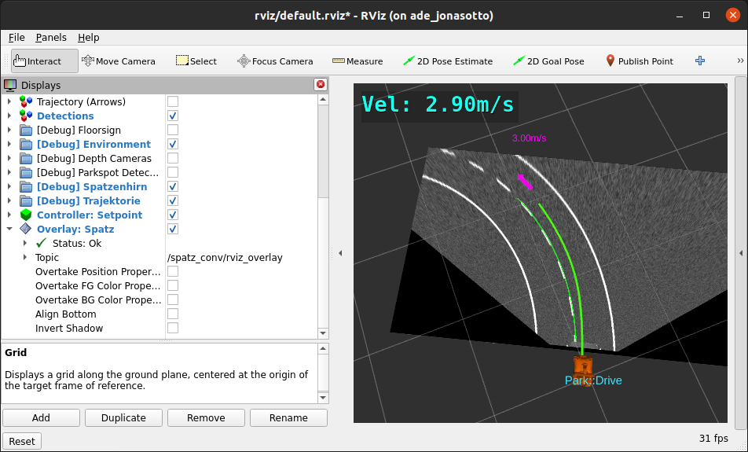
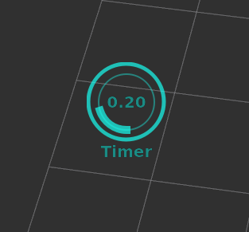

# rviz_2d_overlay_plugins

Plugins and message definitions for displaying 2D overlays over the
RViz2 3D scene.

Based on the [jsk_visualization](https://github.com/jsk-ros-pkg/jsk_visualization)
package, which is currently only released for ROS1, under the 3-Clause BSD license.

See the [hosted doxygen documentation](https://docs.ros.org/en/rolling/p/rviz_2d_overlay_plugins/generated/doxygen) for
both usage information and source code documentation.






```
colcon build --packages-select rviz_2d_overlay_msgs rviz_2d_overlay_plugins
```